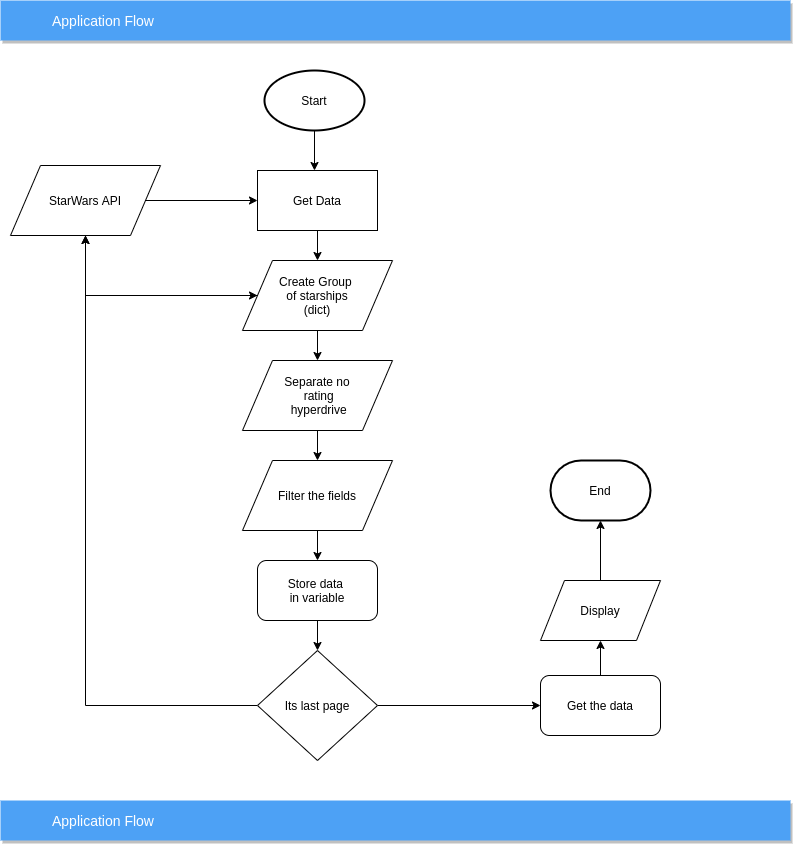

# Star Wars API
Get starships of Star Wars movies, sorted by hyperdrive 

### Requirement:
* Python
* Flask
* docker
### List of content
1. Architecture
2. Running url on docker
4. Unittest with 15 test cases
5. PEP8 with pylint

### Architecture
#### Solution Architecture:


#### Folder Structure:
    --starwars(main application)
      --app
        --main
          --__init__.py
          --config.py
          --router.py
          service.py
        --test
          --base.py
          --test_starwars.py
          --test_starwars_api.py
        --__init__.py
      --__init__.py
      --app.ini
      --docker-local-entrypoint.sh
      --local.Dockerfile
      --requirement.txt
      --run.py(main file to run application)
    --nginx
    --docker-compose.yml
    --traefik.toml(to monitor the trafic with list of url)
#### Step-1
1. Install Docker 
2. git clone https://github.com/sbsanjaybharti/star_war_ships
3. I am assuming Docker is already install in your system if not then follow this link https://docs.docker.com/get-docker 
3. Open the terminal in main folder and run the command<br/>
```ubuntu
docker-compose build
docker-compose up
```
#### Step-2
1. Open the URl localhost:8080 here you will get the URL to run the service.
you can directally use this http://starwars.localhost/

3. To run the test cases open new terminal in same folder and run the command, first command will take you in the container and second command to run the test.
```python 
docker-compose exec ghibli /bin/bash 
python run.py test
``` 
4. To test PEP8 status
```python 
docker-compose exec ghibli /bin/bash 
python -m pylint <filename>
``` 
first command will take you in the container and second command to run the pylint.
replace <filename> with actual file name eg. run.py, src/service.py and so on

 
##### Advantage:
1. Number of iteration is reduce
2. Clean code and tested code has been written
3. Builder pattern with Flyweight patter is used to minimize iteration and membory usage. 

